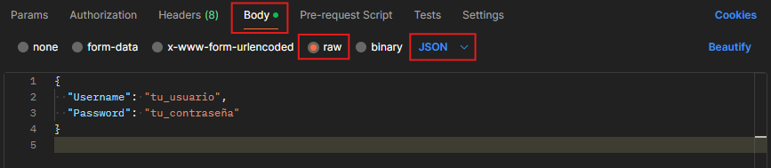
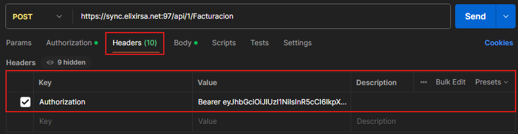
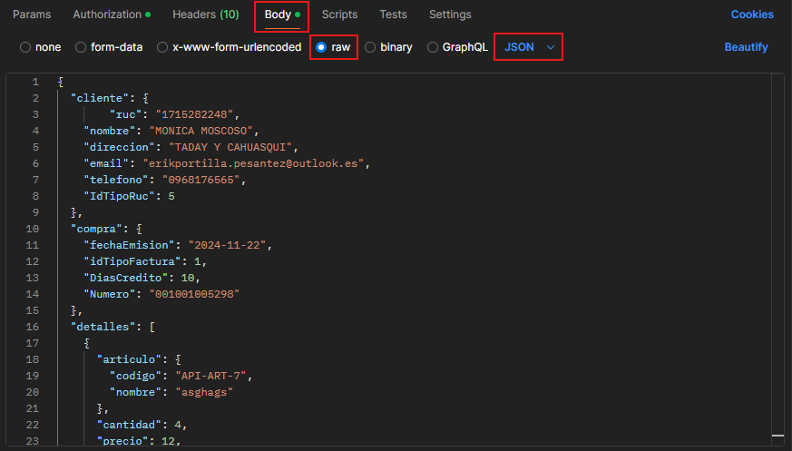

# Guía Básica para Usar la API de Facturación de Latinium con Postman

## Requisitos Previos
- Postman instalado en tu computadora
- Credenciales proporcionadas por Elixir Software (username, password, tenantId)

## Paso 1: Generar Token JWT
### Configuración de la Solicitud
- Abre Postman
- Crea una nueva solicitud POST
- URL: `https://sync.elixirsa.net:97/api/{tenantId}/Auth/login`
- Método: POST

### Imagen 1: Configuración de Solicitud de Token

- Barra de URL con la dirección completa
- Método POST seleccionado
- Pestaña de Body seleccionada

### Body de la Solicitud
- Selecciona la pestaña "raw"
- Elige formato JSON
- Introduce el siguiente JSON:
```json
{
  "Username": "tu_usuario",
  "Password": "tu_contraseña"
}
```

### Imagen 2: Body de Solicitud de Token

- Pestaña "raw" seleccionada
- Formato JSON
- JSON de login completado

## Paso 2: Crear una Factura
### Configuración de la Solicitud
- Crea una nueva solicitud POST
- URL: `https://sync.elixirsa.net:97/api/{tenantId}/Facturacion`
- Método: POST

### Configuración de Headers
- Agrega un header:
    - Clave: `Authorization`
    - Valor: `Bearer {token_generado_en_paso_1}`

### Imagen 3: Headers para Solicitud de Factura

- Pestaña de Headers
- Header de Authorization con token

### Body de la Solicitud de Factura
- Selecciona "raw" y JSON
- Usa el ejemplo de solicitud completa del documento

### Imagen 4: Body de Solicitud de Factura

- Pestaña "raw" seleccionada
- Formato JSON
- JSON de facturación completado

## Consejos Importantes
- Reemplaza los valores de ejemplo con tus datos reales
- Verifica que todos los campos obligatorios estén completos
- Presta atención a los códigos de error

## Posibles Errores Comunes
- Credenciales incorrectas
- Campos obligatorios faltantes
- Tipos de datos incorrectos

## Validaciones Clave
- RUC debe tener 13 dígitos
- Cédula debe tener 10 dígitos
- Asegúrate de tener todos los códigos correctos (proyecto, subproyecto, etc.)

## Ejemplo Cuerpo Mínimo Funcional
```json
{
  "cliente": {
    "ruc": "1715282248",
    "nombre": "MONICA MOSCOSO",
    "direccion": "TADAY Y CAHUASQUI",
    "email": "erikportilla.pesantez@outlook.es",
    "telefono": "0968176565",
    "IdTipoRuc": 5
  },
  "compra": {
    "fechaEmision": "2024-11-22",
    "idTipoFactura": 1,
    "DiasCredito": 10,
    "Numero": "001001005298"
  },
  "detalles": [
    {
      "articulo": {
        "codigo": "API-ART-7",
        "nombre": "NUEVO PRODUCTO 2"
      },
      "cantidad": 4,
      "precio": 12,
      "descuento": 2,
      "impuesto": 15,
      "CodigoIva": "0"
    },
    {
      "articulo": {
        "codigo": "API-ART-2",
        "nombre": "NUEVO PRODUCTO 1"
      },
      "cantidad": 10,
      "precio": 15,
      "CodigoIva": "4"
    }
  ]
}
```

### Imagen 5: Respuesta Exitosa

- Código de respuesta 200
- JSON de respuesta con `success: true`
- Número de factura generado

## Recomendaciones Finales
- Prueba primero con datos de ejemplo
- Contacta con soporte de Elixir Software para dudas específicas
- Mantén tus credenciales seguras
